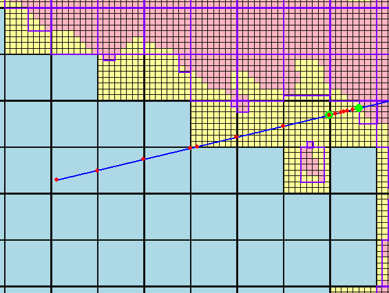

## DDATest

Voxel ray traversal algorithm prototype

#### Overview

- Two level tree DDA search algorithm
    - Lower resolution voxel buffer
    - Higher resolution voxel buffer
    
Inspired by brickmap paper: https://studenttheses.uu.nl/handle/20.500.12932/20460

#### Algorithm
- 0: Traverse across low resolution voxels (chunks)
- 1: If a chunk contains high resolution voxels do a bounding box check
    - Bounding box is a AABB computed from the voxels within this "chunk"
- 2: If the ray bounding box check fails, continue traversing across chunks (back to step 0)
- 3: Else, traverse across high resolution voxels in the chunk
- 4: If the ray never hits a voxel and exits the chunk's bounds, traverse across chunks (back to step 0)
- 5: Else, hit a voxel, return any information needed, end.

#### Voxel Ray Traversal Example

Written in python